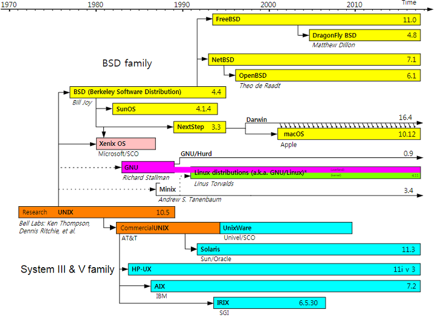

# 1강. 리눅스 소개

- 강의에 앞서
  - 리눅스 초보자를 위한 강의입니다.
  - 교재를 천천히 읽어보세요.
  - 리눅스를 설치한 후, 항상 실습을 통해 확인하세요.
  - 인터넷 사이트나 참고 자료를 활용 하세요.

## 1.1 유닉스와 리눅스

- UNIX의 특징

  - `다중 사용자`, `다중 작업`을 지원하는 신뢰성 높은 운영체제 `(시분할 운영체제)`

- UNIX와 리눅스

  - 리눅스는 UXIN의 `무료 공개 버전`
  - 초기에 리눅스는 `PC용 운영체제`로 개발되었음

- UNIX 발전사(1)

  - 최초의 UNIX
    - Multics
      - 1969년 assembly 언어로 작성된 최초의 `시분할 운영체제`
    - Unics → Unix
      - `작고 심플한` 운영체제로 다시 작성됨
      - 1973년 대부분이 C 언어로 다시 작성됨
      - C로 짜여져 있어 `이식성이 뛰어나다`
  - 대표적인 UNIX 시스템
    - `BSD 계열` : `Free BSD`, `SunOS` ( 버클리 소프트웨어 디스트리뷰션 - 버클리대학의 유닉스 버전 )
      - 자유롭고 공개된 방식으로 운영체제 개발이 진행되었다.
    - `System V 계열` : HP-UX, IBM AIX, Solaris ( 앞에 기업이름이 들어가 있다. )
      - 상업적인 목적으로 유닉스 계열의 운영체제를 제공하게 되었다.
    - `리눅스`

- UNIX 발전사(2)

  - 
  - BSD 계열
    - 리눅스는 BSD 계열에 속한다고 볼 수 있다.
  - SYSTEM Ⅲ & V family 계열
  - 리눅스
    - `탄넨바움 교수의 minix`를 아이디어를 받아, `리눅스 토발즈`가 `리눅스`를 만들었다.
    - 리눅스는 `BSD`, `SYSTEM Ⅲ & V family`들 처럼 독립적인 계열로 볼수 있고 BSD계열에 속한다고도 할 수 있다.

- 리눅스의 등장(1)

  - 1983년 GNU 프로젝트
    - `리처드 스톨만`이 `UNIX와 유사한 공개 운영체제`를 개발하기 위해 GNU 프로젝트를 시작
    - 소프트웨어 `상업화에 반대`하고 `소스코드의 공유`, `자유로운 사용`과 `베포`를 주장
    - `1985년 GNU 선언문(Manifesto) 발표`
    - `1989년 GPL을 발표` - 공개 소프트웨어의 라이센스 (일반 공개 라이센스)
    - 현재 `Free Software Foundation(FSF - 자유 소프트웨어 재단)`이라는 이름으로 활동

- 리눅스의 등장(2)

  - 1991년 `리눅스 커널(kernel)`

    - `리누스 토르발스`는 `리눅스 커널`을 작성하여 발표

      - 커널은 하드웨어를 제어하고 응용 프로그램과의 상호 작용을 제공하는 운영체제의 핵심

        > `커널` → 운영체제의 구성 요소 하드웨어를 제어하고, 응용프로그램과의 상호작용을 제어하는 운영체제의 핵심. CPU제어, 메모리 관리 등. 운영체제와 하드웨어간에 다리역할을 하는 것.

    - 개발자인 Linus와 UNIX의 이름을 따서 Linux라고 명명

  - 1992년

    - `최초 리눅스 베포판 MCC Interim 리눅스`가 발표됨
    - 보통 `리눅스`라 함은 `리눅스 커널을 사용한 운영체제(리눅스 베포판)`를 의미함
    - `GNU Linux`라고 부르기도 한다.

  - 1998년

    - IBM과 Oracle이 리눅스 지원을 발표

## 1.2 리눅스 개요

- 리눅스의 발전상
  - 전 세계 리눅스 사용자는 `9,160만명` 정도로 추산됨
    - linuxcounter.net 에서 확인 가능하다고 함
  - 유수의 `100만 도메인 중 95% 이상`이 리눅스를 사용
  - 스마트폰의 `80% 이상이 리눅스 기반`의 안드로이드에서 동작
    - 아이폰은 유닉스
  - `슈퍼컴퓨터의 95%`가 리눅스에서 운영됨
  - 주요 `증권거래소`, `Google`, `Twitter`, `Facebook`, `Amazon`에서 리눅스 서버를 사용
  - `대다수 전자장비(폰, TV 등)`에서 리눅스를 사용
- 리눅스의 특징(1)
  - `다중 사용자`와 `다중 작업`을 지원 - `시분할 지원`
  - `뛰어난 이식성`을 제공
  - `모듈화`되어 있어 `업그레이드` 또는 `업데이트가 용이함`
  - CUI와 GUI를 지원
    - `Character UI(CUI or CLI)` : `셸(shell)`을 통해 `커맨드를 입력`
    - `Graphical UI(GUI)` : `X Window`와 `GNOME`, `KDE` 등의 `데스크톱`
  - 소스코드가 공개됨
    - `공개 소스`로서 `빠르게 발전`하고 `보완`됨
  - `sheel script를 작성해서 사용할 수 있다`
- 리눅스의 특징(2)
  - 여러 종류의 파일 시스템을 지원
    - Minix(초기의 Linux), ext 계열, FAT(dos), FAT32(window), NTFS, NFS, ISO-9660(CD-ROM) 등
  - 효율적 하드웨어의 활용
    - 다른 운영체제에 비해서 `저사양 고비율` 성능이 가능하다.
  - `다양한 응용 프로그램`과 `소프트웨어 개발 환경`을 제공한다.

## 1.3 오픈소스와 라이선스

- 오픈소스
  - `개발자(저장권자)가 소스코드를 공개`하여 `누구나 사용, 수정, 공유할 수 있도록 허가`한 소프트웨어
  - 반대 개념은 `"proprietary((독점, 상용) closed) 소프트웨어"` 라고 함
- 소프트웨어 라이센스
  - 컴퓨터 프로그램은 `지식재산권으로 보호`받는 `저작물`
  - 원칙적으로 `저작자가` `공포`, `복제`, `베포`, `개작`할 `권한`을 가짐
    - `일부는 역공학도 금지되어 있다고 한다.`
  - `타인에게 일정한 대가`나 `조건을 전제`로 `권한을 부여`할 수 있음`(라이센스)`
    - `라이센스 - 개발자나 사용자간에 소프트웨어 조건을 명시한 것`
  - https://opensource.org/licenses
- 오픈 소스의 장점
  - 누구나 잘못된 점을 발견하고, 알리거나 고칠 수 있음
  - 배울 수 있고, 효율적 프로그램 개발에 적용할 수 있음
  - 오픈 소스는 여러 사람에 의해 테스트되어 안전함
  - 오픈 소스 운동의 철학은 `커뮤니티를 통한 협력, 공유, 개발`이 발전을 위해 효율적이라는 것
- `GNU 프로젝트`와 `자유 소프트웨어` 운동
  - 목적에 상관없이 프로그램을 실행할 수 있는 `자유`
  - 프로그램을 복제하고 공유할 수 있는 `자유`
  - 소스코드를 개작할 수 있는 `자유`
  - 개작된 프로그램을 배포할 수 있는 `자유`
    - 소프트웨어의 소스코드는 `공개`
- 리눅스의 라이센스
  - 리눅스는 독점되거나 베타되지 않는 자유 소프트웨어
    - 공개 라이센스에 따라 자유롭게 고치고 배포 가능
  - 주로 `GPL(GNU, General Public License)를 따름`
  - 일부는 LGPL(GNU Lesser General Public License)이다. (LGPL은 GPL보다 약한 개념이다.)
  - X Window는 MIT 라이센스이다.
- GNU GPL
  - 자유롭게 사용, 복제, 배포
  - 필요에 따라 자유롭게 수정하고 배포
  - `수정하고 배포하는 경우 소스코드를 공개하여야 한다`
  - 수정된 소프트웨어에 저작권을 표시하고 똑같이 GPL조건으로 배포하여야 한다.
- 다양한 오픈소스 소프트웨어 라이센스
  - GPL, LGPL, MPL
    - 소스코드를 공개하여야 하는 `카피레프트 라이센스`
      - `기본적으로 코드를 공개`하도록 함
    - `LGPL`은 주로 `오픈소스 라이브러리`에 적용됨
    - `MPL 코드와 결합`하여 프로그램을 만들 때, `MPL 코드를 포함하지 않은 파일은 공개 의무가 없음`
    - 소스코드의 공개 범위는 다르게 정의됨
      - `전체` / `파일` / `모듈` 단위 등
  - BSD, Apache, MIT 라이센스
    - `배포 시 소스코드의 비공개가 허용됨`
    - `Permissive(관대하다, 허용된다) 라이센스`라고 함
    - `코드의 재사용을 높이려는 목적`

## 1.4 리눅스 베포판

- 리눅스 배포판의 역사
  - `리눅스 배포판`은 `리눅스 커널` 외에 `시스템 유틸리티`, `응용프로그램`, `설치 프로그램`을 포함한 `완전한 운영체제`
  - 리눅스 커널은 `1991년 처음 개발됨`
    - 1994년 커널 1.0이 발표되었고 최신 안정 버전은 4.12
  - 1992년 `최초의 배포판` `MCC Interim`과 `SLS(Softlanding Linux System) 배포판`이 발표됨
  - 1993년부터 주요 배포판이 나오기 시작함
- 주요 리눅스 배보판의 종류
  - Debian 계열 : Debian, Ubuntu 등
  - Slackware 계열 : Slackware, SUSE 등
  - Red Hat 계열 : Redhat, Fedora, CentOS 등
- Debian 리눅스
  - Debian 프로젝트
    - 자유 운영 체제를 만들어가는 사람들의 독자적인 모임
    - `lan Murdock`에 의해 `1994년에 비영리 조직`으로 설립
  - `GNU 정신에 가장 충실한 배포판`
    - `GNU의 공식적인 후원`을 받는 유일한 배포판
  - 세 가지 릴리스를 유지
    - stable, testing, unstaable
    - 코드명을 가지며 unstable 버전은 항상 코드명이 sid
- Red Hat 리눅스
  - 배포판 가운데 가장 널리 알려진 리눅스
  - Red Hat Linux
    - 2003년 지원 중단 : 마지막 버전은 9
  - Red Hat Enterprise Linux(RHEL)
    - Red Hat 사에 의해 지원 : 최신 버전은 7
  - Fedora라는 오픈소스 프로젝트를 지원
  - `RPM(Red Hat Package Manager)` - 보다 개선된 패키지 관리자인 YUM도 공부할 것이다.
    - 바이너리, 설정파일, 라이브러리, 문서 등을 일괄 관리 기능
    - 데이터베이스를 검색하여 패키지나 특정 파일의 검색 기능
    - 패키지에 필요한 파일, 의존성 유무 등을 조사하는 기능
- CentOS 리눅스
  - Red Hat 리눅스로부터 파생
  - Red Hat Enterprise Linux(RHEL) 기반의 무료 버전
    - RHEL의 소스코드를 기반으로 만들어지는 무료 배포판
    - RHEL은 유료로 지원
  - 서버용으로 많이 사용됨
  - 최신 버전 : 7.3
- SuSE 리눅스
  - Slackware 리눅스로부터 파생
  - 독일에서 만든 배포판, 유럽에서 많이 사용
  - Software und System Entwicklung의 약자
  - 풍부한 기능, 안정성, 보안 기능을 포함
  - Novell 사에 의해 지원
  - 두 가지 종류
    - SUSE Linux Enterprise(유료)
    - openSUSE(무료)
- Slackware 리눅스
  - SLS 리눅스로부터 파생
  - 가장 먼저 대중화된, 현존하는 가장 오래된 배포판
  - 1992년 Patrick Volkerding에 의해 시작됨
  - 간결함을 설계 철학으로 함 (the KISS principle)
    - 현재 GNOME desktop이 제외되어 있음
  - `유닉스 자체 학습에 적함`
- Ubuntu 리눅스
  - Debian 리눅스로부터 파생
  - `데스크톱 Unity`를 제공하여 `리눅스를 쉽게 사용`할 수 있도록 함
  - `Debian 리눅스`에 비하여 `사용 편리성에 중점`을 둠
  - `(초보자에게)인기 있는 리눅스` 배포판 중 하나

