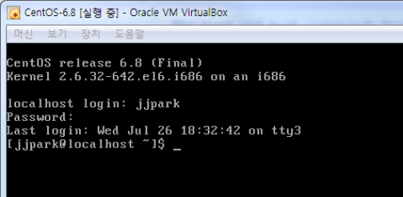
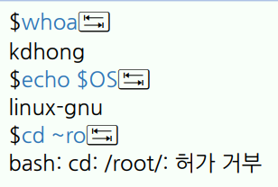

# 3강. 셸 사용하기


## 1. 셸 개요

- 셸(shell)

  - `명령어 해석기` 또는 명령행 인터페이스

    - 사용자와 커널 사이에서 명령어를 해석하여 처리
    - 셸 명령어를 사용하면 GUI로는 하기 힘든 다양한 기능을 수행할 수 있음

  - `셸 명령을 프로그램으로 작성`하여 처리할 수도 있음

    - `셸 스크립트는` 텍스트 파일로, 프로그래밍을 통한 셸 명령의 조합(교재 11장)
    - 반복적으로 수행되는 작업을 `셸 스크립트`로 작성할 수 있음
    - 셸이 쉘 스크립트 파일을 읽어 처리할 수 있음

  - 로그인을 하면 `기본 셸`이 주어짐

    

- 셸 사용하기

  - 터미널에서 로그인을 해야 함

  - GNOME 데스크톱에서 터미널 창을 실행시켜 셸을 사용함

  - `프로그램 > 시스템 도구 > 터미널`

    - 여러 터미널 창을 띄워 사용할 수 있음
    - 셸은 명령 프롬프트와 명령 행을 제공함

  - 기본적으로 한 라인에 명령을 입력하고 `Enter`를 쳐 명령을 수행함

    - 결과가 출력되면 명령 프롬프트가 다시 등장함

    - 세미콜론(;)을 사용하면 한 라인에 여러 명령을 입력할 수 있다.

      

- 셸의 종류

  - 많은 리눅스 배포판에서 bash를기본 셸로 사용함
    - 명령 프롬프트로 일반 사용자는 $, root 사용자는 #을 사용함
  - 셸의 종류에 따라 `에일리어스 설정, 초기화 파일, 스크립트 작성, 명령 행 완성 기능, 명령 행 편집 기능` 등에 차이가 있음

- bash 셸

  - Bourne Again Shell로 Bourne 셸의 개선된 버전
    - 많은 셸 스크립트의 문법이 Bourne 쏄에 기반을 둠
  - C셸과 Korn 쎌의 유용한 기능을 가져옴
  - 실행 명령은 /bin/bash
    - /etc/passwd 파일에 다음과 같은 라인이 있음
    - kdhong: x:500:500:kilDong Hong:/home/kdhong:/bin/bash
    - id: 암호가 있고:사용자 숫자 아이디:그룹아이디:사용자에 대한 설명:사용자의 home디렉터리:기본 셸

- 셸 선택하기

  - 기본 셸을 변경할 수 있음

    - chsh -s /bin/tcsh (chsh는 change shell -s(옵션) 기본 셸 지정)

  - 터미널 창은 대화형 셸임

    - 셸을 종료하려면 exit 명령 또는 Ctrl + d를 실행

  - `로그인 셸`과 `비로그인 셸`을 구별해야 함

    - logout 명령은 로그인 셸에서만 가능

    - 참고로 Ctrl + Alt + F2~6으로 가상 콘솔을 사용할 수 있음

      - 원래대로 돌아가려면 Ctrl + Alt + F1을 누른다.

    - 셸 프롬프트에서 셸 프로그램을 실행하면 \``서브 셸`\`이 실행됨

      


## 2. 셸 명령

- 셸 명령의 형식과 실행

  - `$` 명령어 옵션 인수
    - 예: usermod -L dev-do
    - 옵션과 인수는 여럿일 수 있으며 선택적 또는 필수적
  - 명령어는 프로그램의 이름
  - 가장 간단한 형태의 실행은 명령의 이름만 사용
    - who, date, ls, pwd

- `chsh 명령`

  - 기본 셸을 바꾸는 명령
  - chsh [optios] [username]
    - `대괄호는 생략 가능`, `이탤릭체는 적당한 내용으로 대체`해야 한다.
    - `복수는 여러 개가 가능`하다는 의미

- 옵션과 인수(1)

  - 짧은 옵션(-)
    - ls -l
    - `ls -lat`와 `ls -l -a -t`는 같은것
  - 긴 옵션(--)
    - ls --all는 ls -a와 동일
  - 인수는 명령의 수행 대상을 지정하는 것
    - cat -n /etc/passwd ( 라인 넘버와 같이/etc/passwd 파일 내용을 출력해라 )
    - grep "KilDong Hong" /etc/passwd ( /etc/passwd 파일에서 "KilDong Hong" 이라는 문자열을 가진 라인을 출력하라 )
  - 옵션도 인수를 가질 수 있음
    - chsh -s /bin/sh kdhong ( kdhong은 인수 -s /bin/sh 는 기본 셸을 지정)
    - chsh --shell=/bin/bash kdhong ( 해당 내용은 긴 옵션이며 위에 짧은 옵션과 같은 내용 )

- 명령어의 종류

  | 에일리어스 | alias 명령을 사용하여 만든 명령의 별칭             |
  | ---------- | -------------------------------------------------- |
  | 셸 예약어  | 예약된 단어로 do, while, case 등                   |
  | 함수       | 셸에서 수행되는 함수의 정의                        |
  | 내장 명령  | 셸 내부에 존재하는 명령으로 cd, echo, pwd, help 등 |
  | 일반 명령  | 실행 파일이 존재하는 명령                          |

  - 환경변수 PATH에 설정된 경로 중에 실행 파일이 존재하면 이름만으로 실행이 가능
    - 아니면 절대 경로를 사용해야 함
    - 현재 디렉터리(.)는 보통 PATH에 포함되어 있지 않음
    - `echo $PATH`로 저장된 경로를 확인할 수 있음

- alias 명령

  - 자주 사용되는 명령의 단축명령을 만드는 명령
    - alias
    - alias la=\`ls -A\`
    - alias rm = \`rm -i\`
  - 계속 유지하려면 `셸의 환경 설정 파일`에 기록해 두어야 한다.

- type 명령

  - 명령이 `어떻게 해석되는지` 알려 주는 명령
    - type cd
    - type -a ls

- which 명령

  - 실행 프로그램을 환경 변수 PATH를 기초로 찾아 경로를 출력함
    - which rm (비슷한 명령어로 `whereis` rm)

- man 명령

  - 메뉴얼 페이지를 보여줌

    - 명령의 사용법이나 설정 파일 등 관한 온라인 도움말을 제공

    - man passwd 또는 man 5 passwd

    - 명령어의 간단한 도움말을 보려면 명령 --help를 사용할 수 있음

      | 섹션 | 내용                   | 섹션 | 내용                 |
      | ---- | ---------------------- | ---- | -------------------- |
      | 1    | 사용자 명령            | 5    | 시스템의 설명 파일   |
      | 2    | 커널의 시스템 호출     | 6    | 게임                 |
      | 3    | C라이브러리 함수       | 7    | 파일 포맷, 인코딩 등 |
      | 4    | 디바이스 드라이버 정보 | 8    | 시스템 관리 명령     |


## 3. 명령 히스토리

- history 명령

  - 이전에 수행했던 명령 행의 목록을 불러옴
    - history또는 history 10

- 히스토리 기능을 이용하여 명령을 실행하는 방법

  - 이전에 수행했던 명령을 이용하여 명령을 수행할 수 있음

  - 다음을 입력하고 실행함

    - 명령 행 편집도 가능

    | 입력 방법 | 설명                                        |
    | --------- | ------------------------------------------- |
    | !!        | 직전 명령을 불러옴                          |
    | !n        | 히스토리 목록에서 해당 명령을 불러옴        |
    | !string   | 지정된 문자열로 시작하는 최근 명령을 불러옴 |
    | ↑ 또는 ↓  | 누를 때마다 직전 또는 직후 명령을 불러옴    |

- 명령 행 완성 기능

  - 일부만 입력하고 나머지를 자동으로 완성하는 기능

  - 처음 몇 자만 입력한 후, tab 키를 누르면 실행됨

    - 명령어, 변수($), 파일, 디렉터리(~ 또는 -) 등을 구분하여 결정함

      

    - ~username은 해당 사용자의 홈 디렉터리를 의미

  - 정보가 충분하지 않은 경우, tab 키를 한번 더 누르면 모든 가능한 경우를 보여주고 원래의 명령행이 유지됨


## 4. 명령의 연결과 확장

- 특수 문자 (1)

  - 쎌에서 특별한 의미를 가지는 문자

    | 문자            | 의미                                                         |
    | --------------- | ------------------------------------------------------------ |
    | 백슬래시(\\)    | 특수 문자의 기능을 제거 하는 이스케이프 (escape) 문자 또는 긴 명령 행을 분리할 때 사용 |
    | 틸드(~)         | ~ 또는 username은 사용자의 홈 디렉터리를 의미                |
    | 도트(.)         | 현재 작업 디렉터리를 표시<br />또는 명령 행의 맨 앞에서 쉘 스크립트를 실행하는 source 명령 |
    | 더블도트(..)    | 현재 디렉터리의 부모 디렉터리                                |
    | 파운드(#)       | # 문자의 뒤에 나타나는 문자를 주석으로 처리                  |
    | 달러($)         | $ 변수는 변수의 값을 추출                                    |
    | 앰퍼샌드(&)     | 명령&는 명령을 백그라운드로 실행시킴                         |
    | 애스터리스크(*) | 파일 이름에서 사용할 때 0개이상의 임의 문자열과 대응됨       |
    | 물음표(?)       | 파일 이름에서 사용할 때 1개 문자와 대응됨                    |
    | 파이프(\|)      | 앞 명령의 출력을 다음 명령의 입력으로 연결시킴               |
    | < 또는 >        | 입출력 리다이렉션에서, 즉 파일로부터 입력받을 때 또는 파일로 출력할 때 사용 |
    | >>              | 표준 출력을 파일의 끝에 덧붙일 때 사용                       |
    | 느낌표(!)       | 명령 히스토리 기능을 이용할 때 사용                          |

- 파이프

  - 앞 명령의 출력 결과를 다음 명령의 입력으로 연결
  - 명령1 | 명령2
    - cat /etc/passwd | sort | more

- 입출력 리다이렉션

  - 명령 수행에 필요한 표준 입력 대신에 파일로부터 얻음

  - 명령 < 파일

    - sort < /etc/passwd 

    

  - 명령 수행의 결과를 표준 출력으로 보내지 않고 파일에 기록함

  - 명령 > 파일

    - grep typedef /usr/include/* > typedef.out

    

  - 명령 수행 중 표준 오류 출력을 파일에 덧붙임

  - 명령 2> 파일

    - ls 2 >> error.txt

- 명령 치환

  - 명령을 수핼할 때, 명령의 인수로서 다른 명령의 결과를 사용

  - $(command) 또는 \`command\` 

    - 역따옴표(\` \`)를 사용함

      ```shell
      $ ls -l $(which passwd)
      # -rwsr-xr-x. 1 root root 25980 2015-11-24 01:28 /ure/bin/passwd
      $ which passwd
      # /usr/bin/passwd
      $ ls -l /usr/bin/passwd
      # -rwsr-xr-x. 1 root root 25980 2015-11-24 01:28 /usr/bin/passwd
      ```

- 인용 부호

  - 빈칸을 포함하는 문자열을 1개의 인수로 사용할 때 인용 부호가 필요함

  - 작은따옴표('')는 특수문자의 의미를 제거함

  - 큰따옴표는("")는 $, \` \`, \\, !를 해석하여 확장함

    ```shell
    $ echo "$(date)"
    # 2020. 09. 14. (목) 22:52:44 KST
    $ echo "\$(date)"
    # $(date)
    echo 'Today is $(date)'
    # Today is $date
    ```

- 수식과 변수의 확장

  - 수식의 결과를 명령 수행 전에 전달

  - `$[수식] 또는 $((수식))`

  - 변수의 값을 추출하여 명령 수행 전에 전달

  - $변수

    ```shell
    $ echo "I am $[2018-1969] years old"
    # I am 49 years old
    $ echo BASH
    # BASH
    $ ls -l $BASH
    # -rwxr-xr-x. 1 root root 877736 2020-09-14 22:55 /bin/bash
    ```


# 5. 셸 변수

- 셸 변수와 환경변수(1)

  - 셸 변수는 셸의 환경을 설정하기 위한 값을 저장
    - 모든 변수와 값을 출력하기 위해 set 명령을 사용
  - 셸 변수
    - 현재 셸에서만 사용이가능하고 서브 셸로는 전달되지 않음`(지역변수)`
  - `환경변수`
    - 현재 셸뿐만 아니라 서브셸로도 전달`(전역변수)`
    - 보통 변수 이름으로 `대문자`를 사용함
    - `터미널 창을 열어 쉘을 시작`하면 `이미 많은 환경 변수가 설정`되어 있음
    - 모든 `환경변수`와 값을 출력하기 위해 `printenv 명령을 사용`

- 셸 변수와 환경 변수(2)

  - 변수 설정과 환경 변수로 만드는 방법

    - `변수=값` (띄어쓰기를 절대로 사용하면 안됨)
    - `export 변수`

  - 특정 환경 변수의 값을 확인하는 방법

    - `printenv 변수`

    - `echo $변수`는 모든 종류의 변수 값을 확인할 수 있음

      ```shell
      $ FOO=bar
      $ export FOO
      $ sh
      sh-4.1$ echo $FOO
      bar
      sh-4.1$ printenv FOO
      bar
      sh-4.1$ exit
      $ unset FOO
      ```

- 자주 사용되는 환경 변수

  | 변수     | 내용                                                         |
  | -------- | ------------------------------------------------------------ |
  | HISTSIZE | 1개 셸에서 저장되는 명령 히스토리 목록의 최대 개수로 기본 값은 1000 |
  | HOME     | 홈 디렉터리                                                  |
  | MAIL     | 사용자의 메일박스에 해당하는 파일로 보통 /var/spool/mail/username |
  | PATH     | 명령을 수행할 때 실행 파일을 찾기 위한 디렉터리 목록         |
  | PS1      | 쉘 프롬프트를 표시하기 위한 문자열                           |
  | SHELL    | 사용 중인 기본 셸                                            |
  | PWD      | 현재 작업 디렉터리                                           |
  | USER     | 현재 사용자 계정                                             |

- 로그인과 셸의 환경 설정 파일

  - 로그인할 때 또는 셸을 시작할 때 자동으로 실행되는 명령을 저장한 파일

    - 시스템 환경 설정 파일과 사용자 환경 설정 파일이 있음

    - 셸의 종류에 따라 다른 이름의 파일을 사용함

    - bash 셸의 경우 다음과 같음

      | 파일              | 설명                                                         |
      | ----------------- | ------------------------------------------------------------ |
      | ① /etc/profile    | 모든 사용자에게 적용. `로그인 할 때` 가장 먼저 수행됨<br />PATH, MAIL, HISTSIZE 등 전역의 환경 변수가 설정됨 |
      | ② ~/.bash_profile | `로그인 할 때` 수행되며 개별 사용자에게 적용됨<br />보통 내부에서 ~/.bashrc를 실행 |
      | ③ ~/.bashrc       | 쉘을 시작할 때마다 수행되며 개별사용자에게 적용됨<br />보통 내부에서 /etc/bashrc를 수행 |
      | ④ /etc/bashrc     | 모든 사용자에게 적용. 쉘을 시작할 때마다 수행됨<br />PS1, 에일리어스 설정, umask를 사용한 접근권한의 초기값, 함수 등을 설정. |
      | ⑤ ~/.bash_logout  | 로그아웃을 수행할 때 실행되는 스크립트 파일                  |

      

