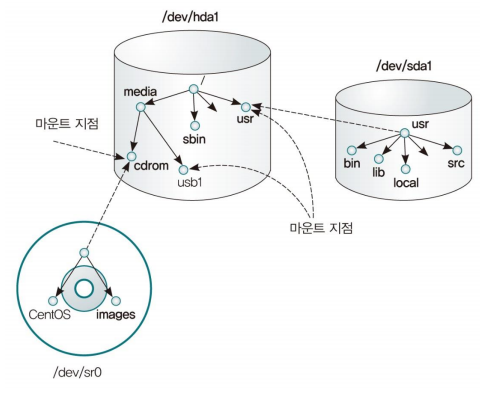
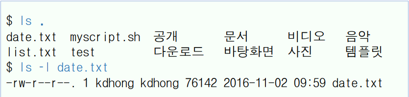
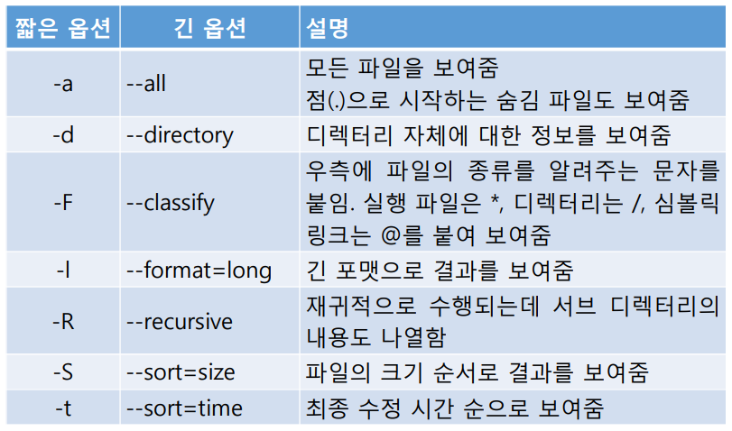

# 4강. 파일과 디렉터리


## 학습목차

1. 파일 시스템 탐색
2. 파일과 디렉터리 관리
3. 파일의 내용 확인


## 1. 파일 시스템 탐색

### 파일시스템

- 운영체제가 디스크(파티션) 상에 파일들을 구성하는 방식

- 파일과 디렉터리의 집합을 구조적으로 관리하는 체계

- 다양한 형식의 파일 시스템이 존재

- 리눅스는 전체 파일 시스템을 1개의 트리 구조로 관리

  - 1개의 루트(/) 디렉터리만 있음

  


### ls 명령(1)

- 파일과 서브 디렉터리 목록을 나열(list)하는 명령

  - 파일(또는 디렉터리)이 가지는 속성도 확인할 수 있음

- ls [options] [names]

  - ls directory
    - 디렉터리에 존재하는 파일과 서브 디렉터리의 정보를 출력
  - ls file
    - 해당 파일의 정보를 출력

  

### ls 명령(2) 

- 옵션

  

  

### 파일의 종류

- 정규 파일
  - 데이터를 저장하는 데 주로 사용
  - 각종 텍스트 파일, 실행 파일, 이미지 파일 등 리눅스에서 사용하는 대부분의 파일
  - 실행 파일이나 이미지 파일의 경우 바이너리 형태로 저장되어 바이너리 파일이라고 함
- 디렉터리
  - 리눅스에서 디렉터리도 파일로 취급
  - 해당 디렉터리에 저장된 파일이나 하위 디렉터리에 대한 정보가 저장
- 심볼릭 링크
  - '소프트 링크'라고도 함
  - 원본 파일에 대한 링크로서 다른 이름으로 파일명을 지정한 것
    - 윈도우의 '바로가기'와 비슷
- 장치파일
  - 리눅스에서 프린터, CD-ROM, 하드디스크, 키보드 등과 같은 각종 장치를 파일로 취급
  - 블록 디바이스 파일과 문자 디바이스 파일로 구분됨


### file 명령

- 파일의 종류를 알려주는 명령
  - file /etc/init.d/sshd

### pwd 명령

- 절대 경로 방식으로 현재 작업 디렉터리를 알려주는 명령

### cd 명령

- 작업 디렉터리를 이동하는 명령
  - 디렉터리를 지정하지 않으면 사용자의 홈 디렉터리로 이동함
- cd [directory]
  - 디렉터리를 지정하는 방법은 절대 경로와 상대 경로가 있음
  - cd /usr/bin
  - cd subdir1; cd../dir1


## 2. 파일과 디렉터리 관리

### mkdir 명령

- 디렉터리를 만드는 명령
- mkdir [options] directories
  - mkdir dir1 dir2 dir3
- 옵션
  - -p는 필요한 경우 상위 디렉터리를 만듦
  - mkdir -p backup/java
  - -m은 디렉터리를 만들면서 접근권한을 설정

### rmdir 명령

- 디렉터리를 삭제하는 명령
  - 비어있는 디렉터리만 삭제할 수 있음
  - 조건 없이 디렉터리를 삭제하려면 (모든 파일과 하위 폴더를 포함) rm -r dir 또는 rm -rf dir 를 사용해야 함(주의가 필요)
- 옵션
  - -p는 비어 있는 디렉터리를 삭제하면서 부모 디렉터리가 비게 되는 경우 사용
  - rmdir -p dir1/dir2


### cp 명령

- 파일이나 디렉터리를 복사하는 명령
- cp [options] file1 file2
  - cp -i file1 file2
  - 대상 파일이 존재한다면 덮어쓰기가 수행됨
- cp [options] files directory
  - 마지막 인자가 디렉터리인 경우
  - 여러 파일을 지정된 디렉터리에 같은 이름으로 복사
  - cp file1 file2 dir1
- cp -r [options] directory1 directory2
  - 디렉터리를 재귀적으로 복사할 때 -r 옵션을 사용
  - 대상 디렉터리가 존재하는 경우, 그 곳에 디렉터리 자체가 복사됨


### mv 명령

- 파일(또는 디렉터리)의 이름을 변경하는 명령
- 또는 다른 디렉터리로 이동하는 명령
- mv [options] source target
  - mv file1 file2
  - 대상 파일이 존재한다면 덮어쓰기가 수행됨
  - mv dir1 dir2
  - 디렉터리의 이름을 변경함
    - 대상 디렉터리가 존재한다면 서브디렉터리로 이동됨
- mv [options] files directory
  - 마지막 인자가 존재한느 디렉터리인 경우
  - 여러 파일을지정된 디렉터리로 이동함
  - mv file1 file2 dir1


## rm 명령

- 파일을 삭제하는 명령
  - 기본적으로 파일만 삭제함
- rm [options] files
  - 파일을 삭제할 때 조심해야 함
  - alias rm='rm -i'를 수행하여 두는 것도 좋은 방법이다.
- 옵션
  - -r 옵션은 디렉터리(포함된 파일과 서브 디렉터리)를 모두 함께 삭제
  - -i 옵션은 삭제 전에 물어봄
  - -f 옵션은 물어보지 않고 무조건 삭제함


### 파일의 접근 권한

- 권한이 없는 사용자의 접근을 막기 위해 접근권한을 설정함
  - 사용자 부류에 따라 읽기/쓰기/실행 권한을 각각 설정함
- 사용자 부류
  - 소유자(u), 그룹(g), 기타(o)
- 권한
  - 읽기(r): 파일의 내용 보기
  - 쓰기(w): 파일의 내용 수정과 삭제 또는 파일 이름 바꾸기
  - 실행(x): 파일을 실행하기
- -rw-rw-r--
  - 앞에 3자씩 끊어서 보면 된다.
  - 소유자 : rw- (읽기 :o:, 쓰기 :o:, 실행 x​ )
  - 그룹 : rw- (읽기 :o:, 쓰기 :o:, 실행 x )
  - 기타 : r-- (읽기 :o:, 쓰기 x, 실행 x )


### 디렉터리의 접근권한

- 권한
  - 읽기(r) : 디렉터리가 가진 파일과 서브 디렉터리의 목록 보기
  - 쓰기(w) : 파일과 디렉터리를 만들거나 삭제하기
  - 실행(x) : 디렉터리로 이동하거나 디렉터리에서 프로그램을 실행하기 또는 파일의 메타 정보 보기
- 디렉터리를 자유롭게 사용하려면 읽기/쓰기/실행 권한을 모두 가져아 함
  - 적어도 읽기/실행 권한을 가지고 있어야 해당 디렉터리로 이동하거나 해당 디렉터리에서 ls -l 명령을 수행할 수 있음


### chmod 명령

- 파일 소유자가 파일의 접근권한을 변경하는 명령
- chmod [options] mode files
  - -R 옵션을 디렉터리에 적용하면 모든 파일과 서브 디렉터리까지 권한을 변경
- 8진수 모드
  - 읽기(r)는 4, 쓰기(ㅈ)는 2, 실행(x) 1
  - 예: rwxr-xr-x -> 111101101 -> 755
  - chmod -R 755 dir1
- 기호 모드
  - 형식은 \[ugoa\]\[+-=\]\[rwx\]
  - ugoa는 각각 user, group, other, all을 의미하며 생략하면 all
  - +-=는 각각 권한의 추가, 제거, 지정을 의미
  - chmod u+x file1
  - chmod u=rwx, g=rx, o=x file2


### umask 명령

- 접근권한의 기본값을 출력하거나 설정하는 명령
  - 보통 /etc/bashrc에 설정되어 있음
- umask [-S] [mask]
  - 단순히 umask (또는 umask -S) 명령을 실행하면 현재 기본값을 알 수 있음
  - -S 옵션은 기호 모드로 결과를 보여줌
  - umask 002
    - 마스크 값이 002라는 것은 -------w-, 즉 기타 사용자에게 쓰기 권한을 부여하지 않겠다는 것
    - 결국 마스크 값이 002라는 것은 775라는 접근권한을 주는 것
    - 파일의 경우 실행 권한은 부여되지 않으며 접근권한은 664가 됨
  - 참고로 touch file명령은 파일의 접근/수정 시간을 현재 시간으로 변경하며 파일이 존재하지 않으면 파일을 생성함


### chown 명령

- root 사용자가 파일이나 디렉터리의 소유자를 변경하는 명령
  - 파일(또는 디렉터리)은 그것을 생성한 사용자 계정과 그룹이 곧 소유자와 소유 그룹으로 설정됨
- chown [oprions] newowner files
  - newowner에 소유자만 주어지면 소유자를 변경하는 것
  - 소유자:그룹 또는 소유자.그룹의 형태로 지정할 수 있음
    - 서유자가 생략되면(:그룹) 변경이 없는 것이며, 그룹이 생략되면 (소유자:) 소유자와 같은 그룹으로 정해짐
  - -R 옵션을 사용하여 디렉터리에 재귀적으로 적용할 수 있음


### ln 명령(1)

- 파일을 다른 이름으로 연결(link)하는 명령
- ln [options] 원본파일명 [대상파일명]
- 기본적으로 하드 링크를 만들며, -s옵션을 사용하면 심벌릭 링크가 만들어짐
- 하드 링크(hard link)
  - 하나의 파일에 다른 이름을 부여하는 것 (원본파일에 이름만 부여하는 것)
  - 원본 파일의 링크 카운트가 증가함
  - 다른 파일 시스템에는 링크할 수 없음
- 심벌릭 링크(symbolic link)
  - 원도우의 '바로 가기'와 같은 역할의 독립적 파일
  - 다른 파일 시스템에 링크를 만들 수 있음
  - 원본을 삭제하면 심벌릭 링크는 의미가 없어짐
  - 디렉터리의 경우, 심벌릭 링크만 만들 수 있음


### ln 명령(2)

- 하드 링크와 심벌릭 링크의 차이

  ```shell
  $ ls -l file1
  -rw-rw-r--. 1 kdhong kdhong 588 2016-11-27 20:27 file1
  
  $ ln file1 file1.hl # 하드 링크
  $ ln -s file1 file1.sl # 심벌릭 링크
  $ ls -li file1*
  284496 -rw-rw-r--. 2 kdhong kdhong 588 2016-11-27 20:27 file1 # 하드 링크는 inode 번호가 같다.
  284496 -rw-rw-r--. 2 kdhong kdhong 588 2016-11-27 20:27 file1.hl
  284718 lrwxrwxrwx. 1 kdhong kdhong 5 2016-12-05 00:23 file1.sl -> file1
  # 심벌릭 링크는 inode 번호가 다르다. 즉 독립적 파일
  ```


## 3. 파일의 내용 파일

### more 명령

- 파일의 내용을 화면 단위로 출력하는 명령
  - 한 화면을 보여준 상태에서 멈춤
- more [options] files
  - 한 화면에 모두 보여 줄 수 없을 때 '--Moreㅡ(69%)'와 같은 메시지가 나옴
  - Space Bar를 누르면 다음화면으로 이동
  - Enter를 누르면 한 라인씩 이동
  - q를 누르면 종료
  - more -20 +10 /etc/services
    - 10번째 라인부터 보여주며, 20라인 단위로 보여줌


### less 명령

- more 명령의 개선된 버전
- 위 또는 아래로 스크롤 할 수 있음
  - page up, page down, ↑, ↓ 등
- 다양한 내부 명령이 있음
  - 라인 / 화면 단위 이동, 라인 / 퍼센트로 위치 지정, 검색 등


### head 명령

- 파일의 맨 앞 부분을 출력하는 명령 (기본은 10 라인)
- head [options] [files]
  - 옵션 `-n 숫자` 또는 `-숫자` 를 사용하면 보고 싶은 라인 수를 변경할 수 있음
  - head -n 5 /etc/passwd
  - head -3 /etc/*.conf


### tail 명령

- 파일의 마지막 부분을 출력하는 명령 (기본은 10라인)
- tail [options] [files]
  - head 명령과 같은 옵션을 사용할 수 있으며, 또 옵션 `-n +숫자` 를 사용하면 해당 라인부터 출력함
- -f 옵션을 사용하면 변화하는 파일의 내용을 계속 감시할 수 있음
  - tail -f /var/log/messages


### cat 명령

- 하나의 파일 또는 여러 파일을 연결(concatenate)시켜 화면에 출력

- cat [options] [files]

  - 파일을 지정하지 않으면 표준입력으로 부터 읽음

    - cat > file을 수행하여 텍스트 파일을 만들 수 있음

  - 여러 파일의 내용을 연결시킬 때 사용할 수 있음(리다이렉션 활용)

  - 옵션 -n을 사용하면 라인 번호를 붙일 수 있음

    ```shell
    $ cat > cat1.txt
    Read (concatenate) one or more files and print them
    on standard output.
    # ctrl+d
    $ cat cat1.txt
    Read (concatenate) one or more files and print them
    on standard output.
    $ cat cat*.txt > total.txt
    ```

    