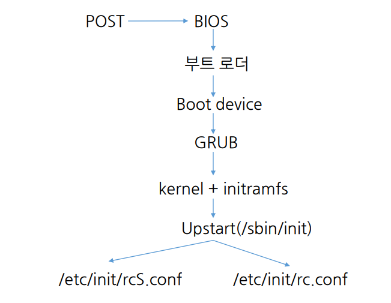
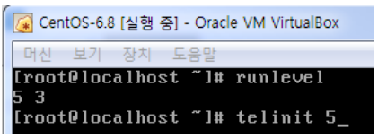
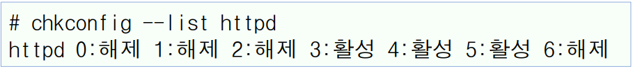

# 5강. 리눅스 시작과 종료

## 학습 목차

1. 운영체제의 부팅
2. 초기화 데몬
3. 시스템 종료
4. 데스크톱

## 1. 운영체제의 부팅

### 부팅 과정 (1)

- 전원을 켜고 로그인 프롬프트가 나올 때 까지 과정
- ROM BIOS의 펌웨어가 실행됨
  - BOIS 기반 x86 컴퓨터를 가정
  - 하드웨어 검사(Power On Self Test : POST 과정) 후, 부트 로더를 적재 
- MBR(Master Boot Record)에 있는 부트 로더가 실행됨
  - 파티션 테이블을 조사하여 부팅 가능한 파티션을 찾음
  - 리눅스의 부트로더인 GRUB를 찾아 적재함
  - GRUB는 그래픽 인터페이스와 멀티부팅을 지원
- 커널 이미지와 initramfs(Initial RAM File System)를 로드 
  - 커널 이미지는 /boot/vmlinuz-\<kernel-version\>
  - initramfs는 부팅 과정에서 필요한 임시 파일 시스템
- 커널이 실행됨

### 부팅 과정 (2)

- 하드웨어를 점검하고 초기화함
  - 메모리, 프로레서, 저장장치, 주변장치 등
  - 디바이스를 찾고 디바이스 드라이버를 로드함
- 루트(/) 파일 시스템을 마운트하고 검사함
- 커널은 /sbin/init 프로그램을 실행시키고 제어를 넘김
  - init 프로세스는 시스템 운영을 위함 나머지 초기화 과정을 처리 (init 프로세스의 PID = 1 이다.)
  - init은 부팅이 끝난 후에도 계속 수행됨

### 부팅의 초기화

1. BIOS 소프트웨어가 동작을 하면 처음에 self test과정을 거치고
2. BIOS프로그램이 돌아가며
3. MBR에서 부트로더를 찾아 적재한다.
4. 부트로더가 부팅 가능한 파티션을 찾고
5. GRUB를 찾아 메모리에 적재한다.
6. GRUB가 실제 부트로더의 기능을 한다.
7. 부트로더가 실제 운영체제 커널와 initial ram file system(initramfs)를 램에 적재 시켜서 그 기능을 수행한다.
8. 그 다음에 kernel이 실행되면서 초기화과정 부팅과정을 처리한다.
9. 커널이 하는 기능이 있고 맨 마지막에 사용자 환경을 준비하는 이 과정은 Upstart(/sbin/init)프로그램에 그 제어를 넘겨서 실행을 시킨다.
10. 해당하는 init 프로세스는 PID가 1이며, 이 과정이 여러가지가 있다.
11. init 데몬 (초기화 데몬)을 Upstart라고 한다. (가정을 하는게 centos 6.8)
12. /etc/init/rcS.conf와 /etc/init/rc.conf 의 두가지 중요한 파일이 있다.

## 2. 초기화 데몬

### '전통적 init 데몬'

- 'System V init 데몬'이라고도 함
- 런레벨(runlevel)에 기초하여 순차적으로 서비스를 실행하는 방식
  - `런레벨에 따라 실행되어야 또는 중단되어야 하는 서비스가 정해짐`
- 시간이 오래 걸리며, 복잡한 초기화 스크립트로 인해 새로운 하드웨어나 서비스의 등장에 효율적 대처가 어려움
  - 모바일 기기와 임베디드의 도입으로 불편함이 생김
- 그래서 업스타트 init 데몬과 systemd 데몬이 나왔다.

### '업스타트 init 데몬'과 'systemd 데몬'

- 이벤트 기반으로 서비스를 실행하는 방식
  - 이벤트가 발생할려면 특정 서비스를 실행시키거나 어떤 이벤트가 발생하면 어떤 서비스는 중지시키거나 한다.
  - 즉, 필요한거만 실행시킬 수 있다. 
  - 그렇기 때문에 부팅 시간을 줄일 수 있다.
  - 멀티 프로세스에서 병렬로 처리될 수 있다.
- 복잡한 스크립트가 간단한 설정 파일들로 대체됨
- Upstart는 Ubuntu에서 개발되어 2006년에 포함되었고 RHEL(RedHat Enterprise) 6에서 채택됨
- systemd 데몬은 2011년 Fedora에서 처음 채택되었음
- `RHEL 7`과 `SUSE` 및 `Ubuntu 16.04`에서 `systemd`가 `Upstart를 대체함`

### init 프로세스 (1)

- 업스타트는 /sbin/init 데몬으로 구현됨
- 모든 사용자 프로세스의 최상위 조상 프로세스(PID가 1)
  - ps -e 또는 ps ax 명령으로 확인
- 나머지 부팅 과정 즉, 시스템 초기화 작업을 실행함
  - 사용자 환경을 준비함. 시스템 운영을 위한 서비스 프로그램의 실행 등
- 계속 수행되며 시스템 운영을 관리하고 셧다운을 처리함
  - 사용자 프로세스의 정리, 로그아웃 후 로그인 서비스의 제공 등

### init 프로세스 (2)

- /etc/init/ 디렉터리에 있는 'job 설정 파일'을 읽음
  - job 설정 파일의 확장자는 .conf
  - init 데몬이 실행하는 job(실행 파일 or 셸 스크립트)이 정의되어 있음
    - 이벤트가 발생할 때 상응하는 job을 시작하거나 중지시킴
- ''전통적 init 데몬''에서는 /etc/inittab 파일을 환경 설정 파일로 사용했음
  - 현재는 초기 런레벨을 설정하는 용도로만 사용됨
  - 이 파일에 업스타트 초기화 과정을 설명하는 내용이 있음
- initctl 명령
  - job의 상태를 확인하거나 수동으로 시작/중지시키는 명령
  - initctl command job
  - initctl list는 모든 job의 상태를 보여줌
  - initctl start job 또는 initctl stop job을 사용할 수 있음

### 환경 설정 파일과 스크립트

- '업스타트 init 데몬'은 기존 방식과 호환되도록 설계됨

| 파일               | 설명                                                         |
| ------------------ | ------------------------------------------------------------ |
| /etc/init/rcS.conf | 부팅 시 한번 실행되며 시스템 초기화와 관련이 있는 내용이 설정되어 있음 주요 작업은 초기 런레벨을 읽고 /etc/rc.d/rc.sysinit 스크립트를 실행하는 것  호스트명 설정, 시스템 점검, 파일 시스템의 마운팅, LVM 장치 활성화, 쿼터 설정 등 서버가 작업을 실행하는 데 필요한 모든 작업을 수행함 |
| /etc/init/rc.conf  | 부팅되거나 런레벨이 바뀔 때 필요한 서비스를 시작시키거나 필요 없는 서비스를 중단시키기 위해 스크립트를 실행함  주요 작업은 /etc/rc.d/rc runlevel을 실행하는 것 |
| /etc/inittab       | 부팅 시 정해지는 초기 런레벨이 정의된 파일  ‘업스타트 init 데몬’을 사용하는 경우 초기 런레벨 외의 다른 설정은 의미가 없음 |
| /etc/rc.d/rc.local | 결과적으로 런레벨 2, 3, 5에서 가장 마지막에 실행되는 스크립트이다. |

### init 프로세스와 런레벨

- 초기 런레벨은 /etc/inittab 파일에서 id:5:initdefault:와 같이 설정되어 있음
- 런레벨이 5로 부팅되는 경우, /etc/rc.d/rc5.d/ 디렉터리에 존재하는 스크립트 파일이 실행됨
  - 이름이 K(Kill)로 시작하는 스크립트는 해당 서비스의 종료를 위한 것이며, S(Start)로 시작하는 스크립트는 해당 서비스의 시작을 위한 것
  - 이러한 파일은 /etc/rc.d/init.d/ 디렉터리에 존재하는 실제 스크립트 파일에 대한 심벌릭 링크임
- 런레벨 2, 3, 5에서 가장 마지막에 실행되는 스크립트는 S99local이 가리키는 /etc/rc.d/rc.local임
  - 관리자가 원하는 특별한 초기화 작업을 추가할 수 있음

### 런레벨

| 런레벨 | 설명                                                         |
| ------ | ------------------------------------------------------------ |
| 0      | 시스템이 종료될 때 사용되는 레벨로 기본값으로 설정해서는 안 됨 |
| 1      | 단일 사용자 모드로, 로그인 과정 없이 root 사용자로 로그인되며 콘솔에서 시 스템 점검이나 복구를 위한 관리자 모드로 사용됨 명령 행 인터페이스가 제공되며 네트워크 서비스는 제공되지 않음 |
| 2      | 기본적으로 네트워크 서비스를 제공하지 않는 다중 사용자 모드  |
| 3      | 모든 네트워킹을 지원하는 다중 사용자 모드로, 리눅스 초기 시절에 보편적으로 사용되었던 레벨이며 명령 행 인터페이스(텍스트 모드)만 지원함 |
| 4      | 사용되지 않음                                                |
| 5      | 그래픽 사용자 환경을 제공하는 다중 사용자 모드  `최근 배포판에서 기본으로 설정됨` |
| 6      | 시스템을 재부팅할 때 사용되는 레벨로 기본값으로 설정해서는 안 됨 |

### telinit 명령

- 런레벨을 바꾸는 관리자 명령
- telinit runlevel
  - telinit 3은 런레벨을 변경하여 텍스트 모드만 지원
  - telinit 0은 종료, telinit 6은 재부팅을 의미

### runlevel 명령

- 이번 런 레벨과 현재 런 레벨을 확인하는 명령어

### chkconfig 명령

- 부팅 시 런레벨에 따른 시스템 서비스의 활성화 여부를 확인하거나 변경하는 명령

- chkconfig [--list] [service]

  - chkconfig --list는 각 런레벨에서 모든 서비스의 활성화 여부를 알려줌

    

- chkconfig [--level *levels*] service <on|off>

  - 특정 런레벨에서 서비스의 활성화 여부를 지정
  - chkconfig --level 345 httpd on은 런레벨 3, 4, 5에서 httpd 서비스를 활성화 시킴

### service 명령

- 시스템 운영 중에 /etc/rc.d/init.d/ 디렉터리에 존재하는 초기화 스크립트를 수동으로 실행 또는 중지시키는 관리자 명령
- service script command
  - service httpd start는 httpd를 시작시킴
  - /etc/rc.d/init.d/httpd start도 마찬가지임
  - command는 start, stop, restart, reload, status 중 하나
- service --status-all
  - 모든 초기화 스크립트의 상태를 출력함
- 데스크톱 메뉴에서 '시스템 > 관리 > 서비스'를 실행하면 나오는 '서비스 설정 창'에서 서비스의 초기 설정(활성화 여부)과 실행의 시작/중지를 시킬 수 있음

## 3. 시스템 종료

### 개인 사용자의 로그아웃

- 계정의 사용을 마치고 빠져 나오는 것
- 데스크톱 환경에서 '시스템 > 로그아웃'
- 로그인 셸에서 logout 또는 exit 명령

### 시스템의 종료

- 관리자가 시스템을 안전하게 셧다운하는 것
  - 접속중인 사용자에게 시스템의 종료를 알림
  - 사용자의 로그인을 차단하고 종료함
- 데스크톱 환경에서 '시스템 > 끄기 ...'
  - '다시 시작', '취소', 또는 '끄기'를 선택

### shutdown 명령

- 시간을 정해 시스템을 안전하게 정료하는 명령
- shutdown [*options*] time [*message*]
- 옵션
  - -r은 재부팅, -c는 셧다운의 취소(time 인수가 필요없음)
  - -k는 실제 셧다운을 하는 것처럼 경고 메시지만 보냄
- time 인수
  - 종료 시간으로 23:15은 절대시간 형식, +10은 10분 후 종료를 의미
  - now는 즉시 종료를 의미
  - shutdown -h now

### 시스템의 종료 절차

- 실제 init 프로세스를 통해 런레벨을 바꾸어 (6 레벨) 셧다운이 처리됨
  - init 프로세스는 모든 프로세스에게 종료를 알림
  - 각 프로세스가 스스로 종료하도록 TERM 시그널을 보냄
  - 종료하지 않은 프로세스에게 강제 종료를 위한 KILL 시그널을 보냄
  - 시스템 파일을 잠그고 파일 시스템을 언마운트함
  - 버퍼에 있는 데이터를 파일 시스템에 기록함(sync)
  - 시스템 호출을 통해 커널에 재부팅 또는 종료를 요청함
- -h 또는 -r 옵션을 사용하지 않으면 단일 사용자 모드로 재부팅됨
- 종료를 위해 halt 명령을, 재부팅을 위해 reboot 명령을 사용할 수 있음

## 4. 데스크톱

### 데스크톱 환경

- GUI를 제공하는 사용자 환경
  - 그래픽 윈도우, 아이콘, 툴바, 메뉴, 위젯 등을 마우스나 키보드로 조작
- 대부분의 데스크톱은 X 윈도우 시스템에 기반을 둠
- 시각적으로 다양한 스타일의 데스크톱이 존재함
  - 일반적으로 서버로 사용하는 리눅스에서는 명령행 인터페이스만 제공

### GNOME

- Red Hat 계열 리눅스에서 기본 데스크톱임
- 단순함, 편의성, 안정성에 초점을 맞춤
  - 기본적으로 상단에 메뉴, 하단에 패널이 위치함
  - 오른쪽 하단에서 2개의 작업 공간을 선택할 수 있음
- 터미널 창에서 gnome-control-center&를 실행하면 제어판이 나옴

### KDE

- 'K 데스크톱'이라고도 하며 MS 윈도우 환경과 유사
- 다양한 프로그램을 통합적인 모습으로 보여줌
- yum -y groupinstall 'KDE 데스크탑'으로 설치할 수 있음
- 로그인할 때 '그놈' 또는 'KDE'를 선택할 수 있음